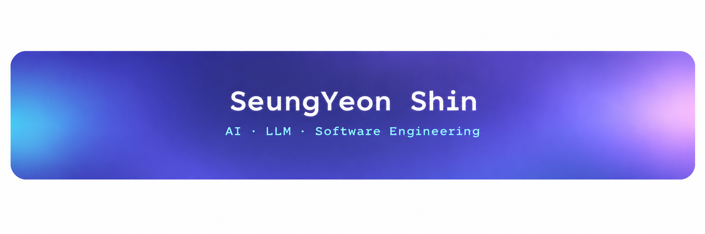
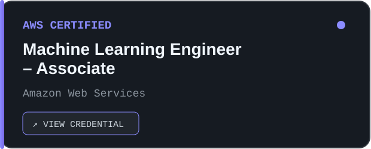
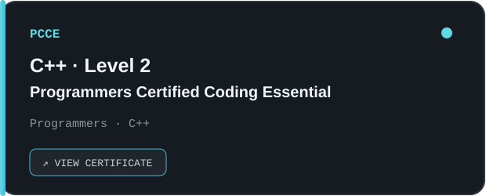

<h3>
생성형 AI와 LLM을 활용한 백엔드 개발에 관심이 있습니다 
아이디어를 실제 서비스로 구현하고 개선하는 과정을 좋아합니다
</h3>

 

---

## `01. ABOUT`

<table>
  <tr>
    <td><b>🎓 Major</b></td>
    <td>Software Engineering</td>
  </tr>
  <tr>
    <td><b>💡 Interests</b></td>
    <td>Generative AI · LLM · Backend · Data</td>
  </tr>
  <tr>
    <td><b>🚀 Focus</b></td>
    <td>AI-powered Backend Service Development</td>
  </tr>
</table>

## `02. TECH STACK`

&nbsp;&nbsp;&nbsp;&nbsp;

&nbsp;&nbsp;&nbsp;&nbsp;

&nbsp;&nbsp;&nbsp;&nbsp;

  

<code>C++</code>
&nbsp;
<code>Python</code>
&nbsp;
<code>Java</code>
&nbsp;&nbsp;&nbsp;&nbsp;
<code>HTML</code>
&nbsp;
<code>CSS</code>
&nbsp;
<code>JavaScript</code>
&nbsp;&nbsp;&nbsp;&nbsp;
<code>MySQL</code>
&nbsp;&nbsp;&nbsp;&nbsp;
<code>Git</code>
&nbsp;
<code>GitHub</code>
&nbsp;
<code>AWS</code>

 

---

## `03. CERTIFICATIONS`

  
  &nbsp;&nbsp;
  

 

---

